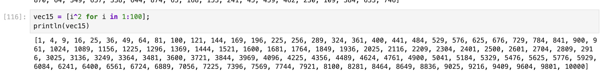

---
## Front matter
title: "Лабораторная работа 2"
subtitle: "Структуры данных"
author: "Ланцова Яна Игоревна"

## Generic otions
lang: ru-RU
toc-title: "Содержание"

## Bibliography
bibliography: bib/cite.bib
csl: pandoc/csl/gost-r-7-0-5-2008-numeric.csl

## Pdf output format
toc: true # Table of contents
toc-depth: 2
lof: true # List of figures
lot: true # List of tables
fontsize: 12pt
linestretch: 1.5
papersize: a4
documentclass: scrreprt
## I18n polyglossia
polyglossia-lang:
  name: russian
  options:
    - spelling=modern
    - babelshorthands=true
polyglossia-otherlangs:
  name: english
## I18n babel
babel-lang: russian
babel-otherlangs: english
## Fonts
mainfont: IBM Plex Serif
romanfont: IBM Plex Serif
sansfont: IBM Plex Sans
monofont: IBM Plex Mono
mathfont: STIX Two Math
mainfontoptions: Ligatures=Common,Ligatures=TeX,Scale=0.94
romanfontoptions: Ligatures=Common,Ligatures=TeX,Scale=0.94
sansfontoptions: Ligatures=Common,Ligatures=TeX,Scale=MatchLowercase,Scale=0.94
monofontoptions: Scale=MatchLowercase,Scale=0.94,FakeStretch=0.9
mathfontoptions:
## Biblatex
biblatex: true
biblio-style: "gost-numeric"
biblatexoptions:
  - parentracker=true
  - backend=biber
  - hyperref=auto
  - language=auto
  - autolang=other*
  - citestyle=gost-numeric
## Pandoc-crossref LaTeX customization
figureTitle: "Рис."
tableTitle: "Таблица"
listingTitle: "Листинг"
lofTitle: "Список иллюстраций"
lotTitle: "Список таблиц"
lolTitle: "Листинги"
## Misc options
indent: true
header-includes:
  - \usepackage{indentfirst}
  - \usepackage{float} # keep figures where there are in the text
  - \floatplacement{figure}{H} # keep figures where there are in the text
---

# Цель работы

Основная цель работы -- изучить несколько структур данных, реализованных в Julia, научиться применять их и операции над ними для решения задач.

# Задание

1. Используя Jupyter Lab, повторите примеры.
2. Выполните задания для самостоятельной работы.

# Выполнение лабораторной работы

Для начала выполним примеры из раздела про кортежи и словари(рис. [-@fig:001]). Кортеж (Tuple) -- структура данных (контейнер) в виде неизменяемой индексируемой последовательности элементов какого-либо типа (элементы индексируются с единицы). В то время как словарь -- неупорядоченный набор связанных между собой по ключу данных.

{#fig:001 width=70%}

Выполним примеры из раздела про множества(рис. [-@fig:002]). Множество, как структура данных в Julia, соответствует множеству, как математическому объекту, то есть является неупорядоченной совокупностью элементов какого-либо типа. Возможные операции над множествами: объединение, пересечение, разность; принадлежность элемента множеству.

{#fig:002 width=70%}

Выполним примеры из раздела про массивы (рис. [-@fig:003]). Массив — коллекция упорядоченных элементов, размещённая в многомерной сетке. Векторы и матрицы являются частными случаями массивов.

{#fig:003 width=70%}

Перейдем к выполнению заданий.

## Задание 1

Даны множества: $A = {0, 3, 4, 9}, B = {1, 3, 4, 7}, C = {0, 1, 2, 4, 7, 8, 9}$. Найдем $P = A \cap B \cup A \cap B \cup A \cap C \cup B \cap C$ (рис. [-@fig:004]):

{#fig:004 width=70%}

## Задание 2

Приведем свои примеры с выполнением операций над множествами элементов разных типов (рис. [-@fig:005]):

{#fig:005 width=70%}

## Задание 3

Создадим массивы разными способами с использованием циклов и встроенных функций (рис. [-@fig:006] - [-@fig:014]):

{#fig:006 width=70%}

{#fig:007 width=70%}

{#fig:008 width=70%}

{#fig:009 width=70%}

{#fig:010 width=70%}

{#fig:011 width=70%}

{#fig:012 width=70%}

{#fig:013 width=70%}

{#fig:014 width=70%}

## Задание 4

Создадим массив squares, в котором будут храниться квадраты всех целых чисел от 1 до 100 (рис. [-@fig:015]):

{#fig:015 width=70%}

## Задание 5

Подключим пакет Primes (функции для вычисления простых чисел). Сгенерируем массив myprimes, в котором будут храниться первые 168 простых чисел. Определим 89-е наименьшее простое число. Получии срез массива с 89-го до 99-го элемента включительно, содержащий наименьшие простые числа (рис. [-@fig:016]).

{#fig:016 width=70%}

## Задание 6

Вычислим следующие выражения (рис. [-@fig:017]).

{#fig:017 width=70%}

# Выводы

В результате выполнения данной лабораторной работы я изучила несколько структур данных, реализованных в Julia, научилась применять их и операции над ними для решения задач.
