---
## Front matter
title: "Лабораторная работа 3"
subtitle: "Управляющие структуры"
author: "Ланцова Яна Игоревна"

## Generic otions
lang: ru-RU
toc-title: "Содержание"

## Bibliography
bibliography: bib/cite.bib
csl: pandoc/csl/gost-r-7-0-5-2008-numeric.csl

## Pdf output format
toc: true # Table of contents
toc-depth: 2
lof: true # List of figures
lot: true # List of tables
fontsize: 12pt
linestretch: 1.5
papersize: a4
documentclass: scrreprt
## I18n polyglossia
polyglossia-lang:
  name: russian
  options:
    - spelling=modern
    - babelshorthands=true
polyglossia-otherlangs:
  name: english
## I18n babel
babel-lang: russian
babel-otherlangs: english
## Fonts
mainfont: IBM Plex Serif
romanfont: IBM Plex Serif
sansfont: IBM Plex Sans
monofont: IBM Plex Mono
mathfont: STIX Two Math
mainfontoptions: Ligatures=Common,Ligatures=TeX,Scale=0.94
romanfontoptions: Ligatures=Common,Ligatures=TeX,Scale=0.94
sansfontoptions: Ligatures=Common,Ligatures=TeX,Scale=MatchLowercase,Scale=0.94
monofontoptions: Scale=MatchLowercase,Scale=0.94,FakeStretch=0.9
mathfontoptions:
## Biblatex
biblatex: true
biblio-style: "gost-numeric"
biblatexoptions:
  - parentracker=true
  - backend=biber
  - hyperref=auto
  - language=auto
  - autolang=other*
  - citestyle=gost-numeric
## Pandoc-crossref LaTeX customization
figureTitle: "Рис."
tableTitle: "Таблица"
listingTitle: "Листинг"
lofTitle: "Список иллюстраций"
lotTitle: "Список таблиц"
lolTitle: "Листинги"
## Misc options
indent: true
header-includes:
  - \usepackage{indentfirst}
  - \usepackage{float} # keep figures where there are in the text
  - \floatplacement{figure}{H} # keep figures where there are in the text
---

# Цель работы

Основная цель работы — освоить применение циклов функций и сторонних для Julia пакетов для решения задач линейной алгебры и работы с матрицами.

# Задание

1. Используя Jupyter Lab, повторите примеры из раздела 3.2.
2. Выполните задания для самостоятельной работы.

# Выполнение лабораторной работы

Для начала выполним примеры из лабораторной работы, чтобы познакомиться с циклами, условными операторами, функциями и работой со сторонними библиотеками (рис. [-@fig:001]-[-@fig:005]).

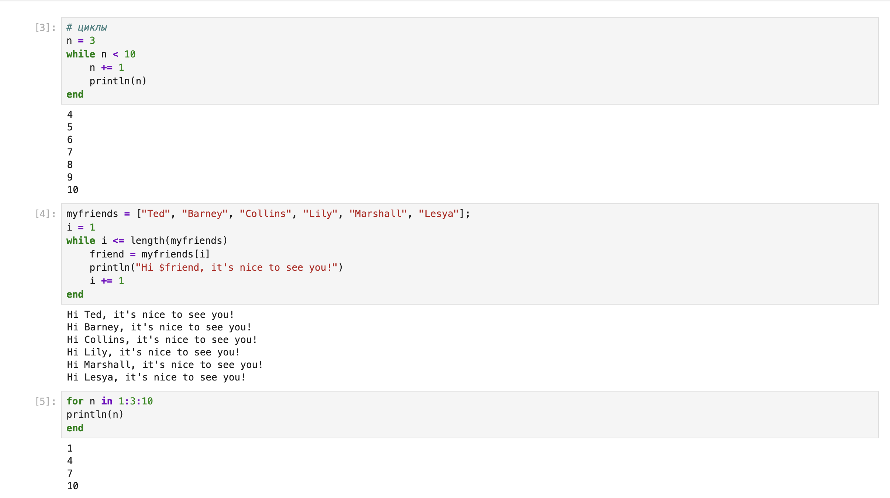{#fig:001 width=70%}

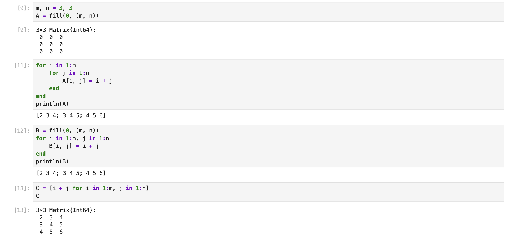{#fig:002 width=70%}

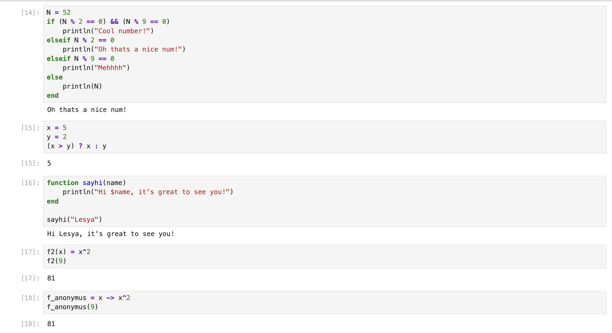{#fig:003 width=70%}

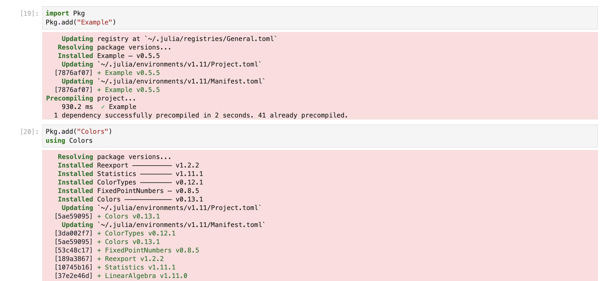{#fig:004 width=70%}

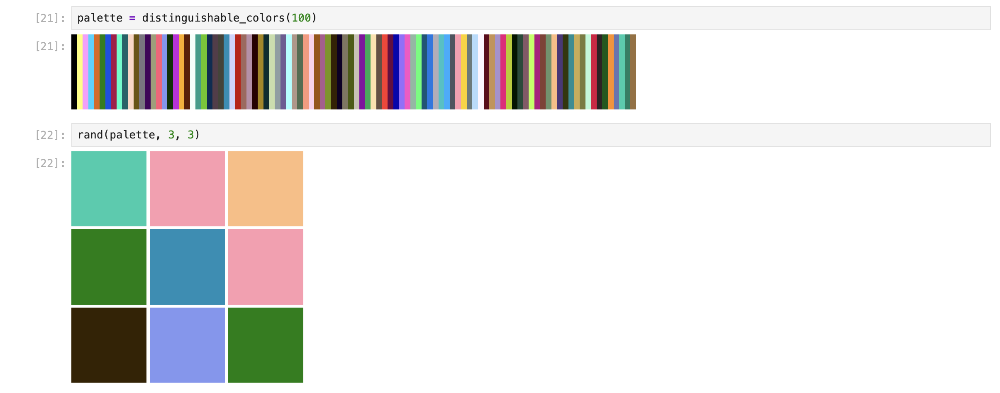{#fig:005 width=70%}

Теперь перейдем к выполнению заданий для самостоятельной работы.

## Задание 1

Используя циклы while и for.

- выведем на экран целые числа от 1 до 100 и напечатаем их квадраты (рис. [-@fig:006])

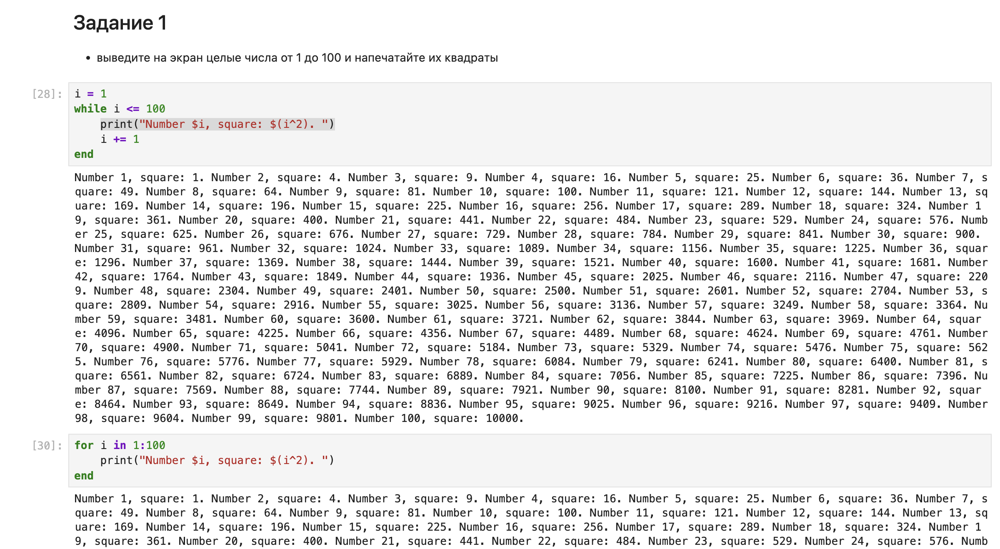{#fig:006 width=70%}

- создадим словарь squares, который будет содержать целые числа в качестве ключей и квадраты в качестве их пар-значений (рис. [-@fig:007])

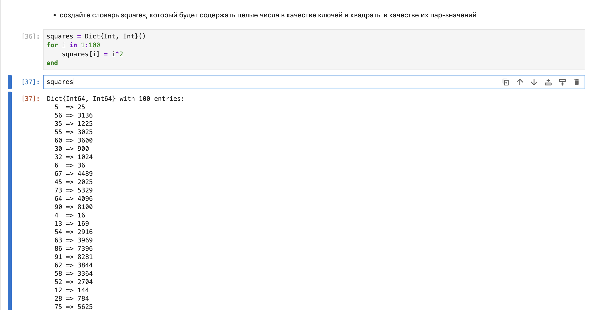{#fig:007 width=70%}

- создадим массив squares_arr, содержащий квадраты всех чисел от 1 до 100 (рис. [-@fig:008])

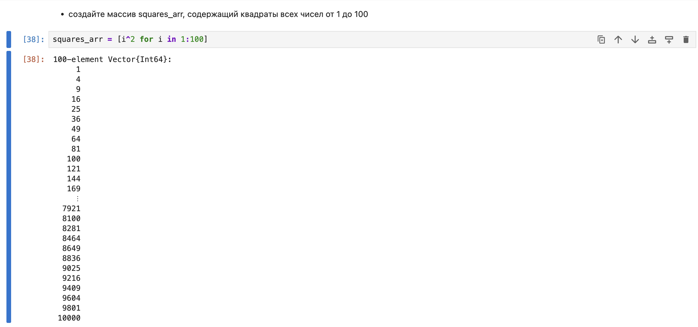{#fig:008 width=70%}

## Задание 2

Напишем условный оператор, который печатает число, если число чётное, и строку «нечётное», если число нечётное. Перепишем код, используя тернарный оператор (рис. [-@fig:009]).

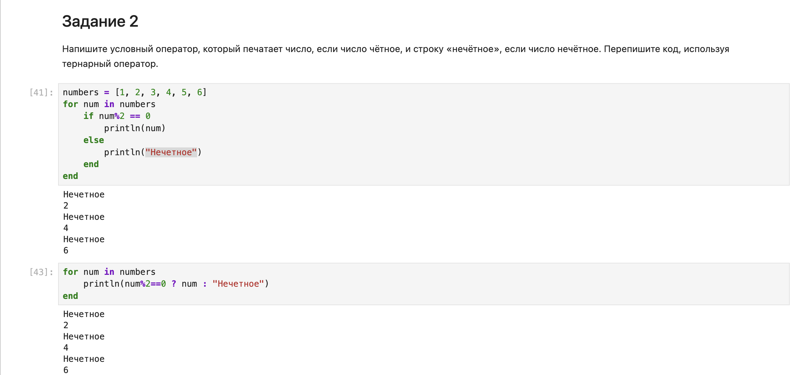{#fig:009 width=70%}

## Задание 3 и 4

Напишем функцию add_one, которая добавляет 1 к своему входу. В следующем задании используем map() или broadcast() для задания матрицы A, каждый элемент которой увеличивается на единицу по сравнению с предыдущим. (рис. [-@fig:010])

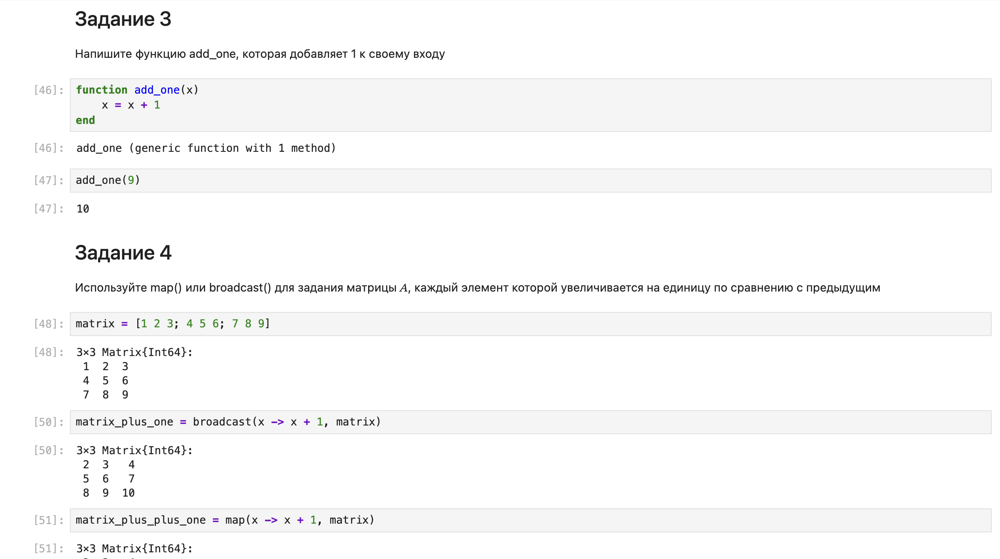{#fig:010 width=70%}

## Задание 5

Зададим матрицу A. Найдем A^3. Заменим третий столбец матрицы A на сумму второго и третьего столбцов (рис. [-@fig:011]).

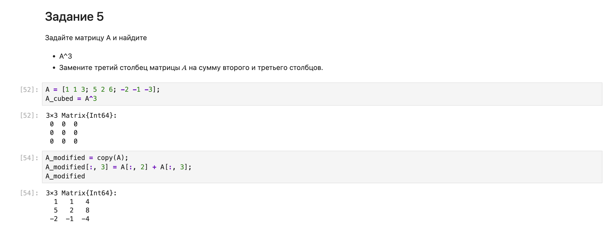{#fig:011 width=70%}

## Задание 6 и 7

Создайте матрицу B с элементами с элементами $B_{i1} = 10$, $B_{i2} = -10$, $B_{i3} = 10$, $i = 1, 2...$. Вычислить матрицу $C = B^T B$ (рис. [-@fig:012]). В следующем задании создадим матрицу Z размерности 6 × 6, все элементы которой равны нулю, и матрицу E, все элементы которой равны 1. Используя цикл while или for и закономерности, нужно повторить матрицы (рис. [-@fig:013] - [-@fig:015]):

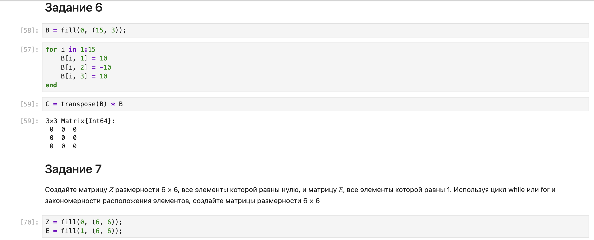{#fig:012 width=70%}

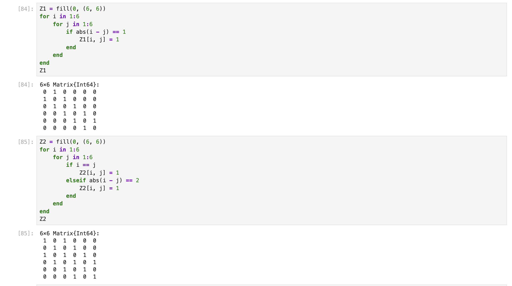{#fig:013 width=70%}

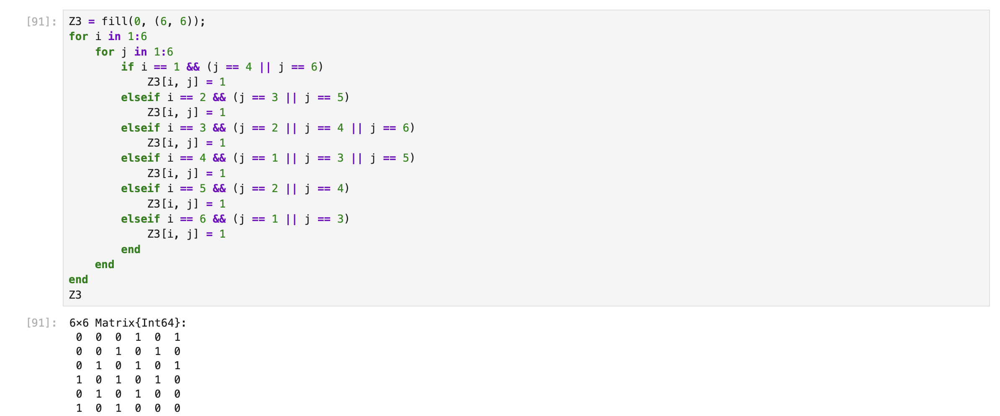{#fig:014 width=70%}

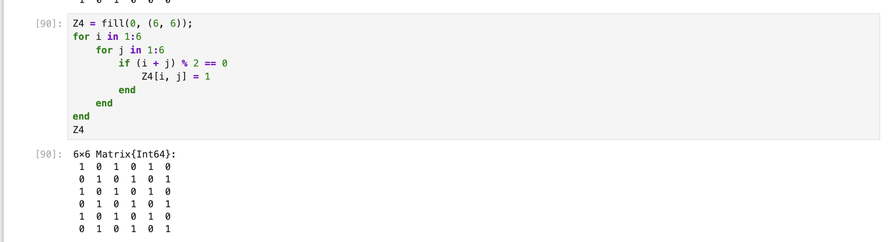{#fig:015 width=70%}

## Задание 8

Напишем свою функцию, аналогичную функции outer() языка R. Функция должна иметь следующий интерфейс: `outer(x,y,operation)` (рис. [-@fig:016]-[-@fig:018]).

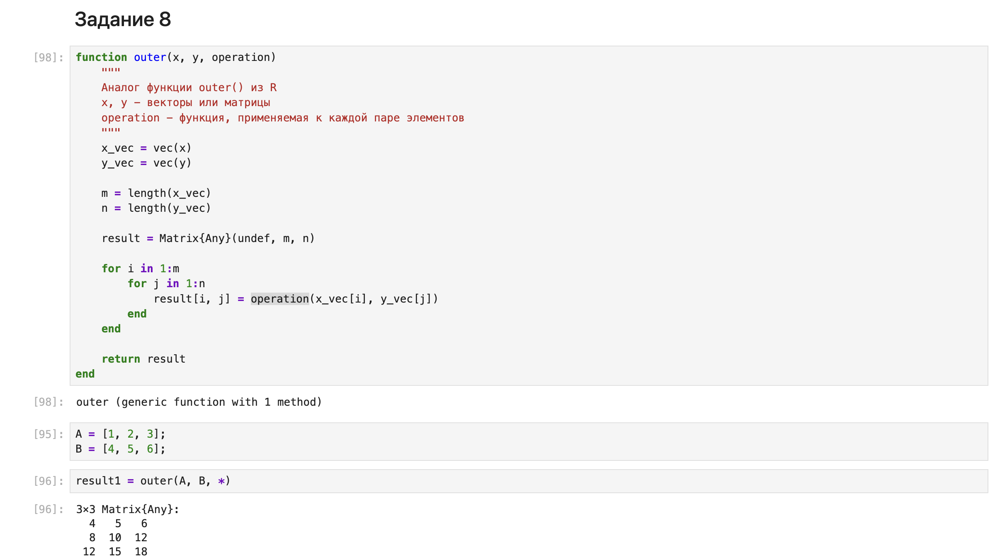{#fig:016 width=70%}

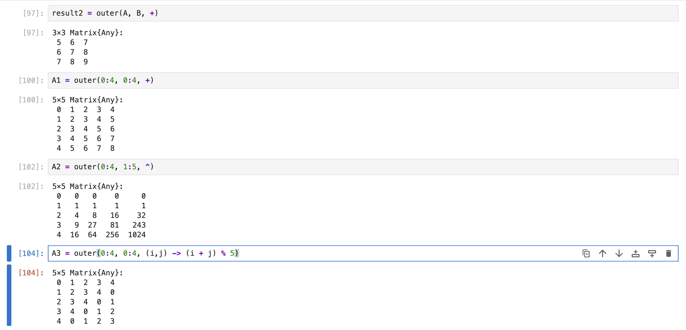{#fig:017 width=70%}

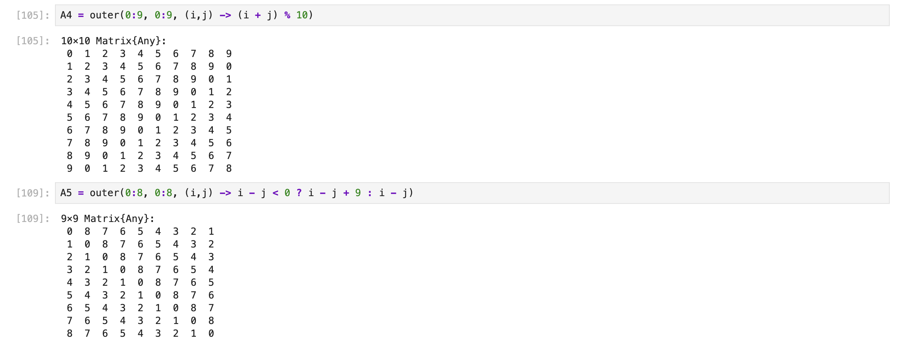{#fig:018 width=70%}

## Задание 9 и 10

Решим систему линейных уравнений с 5 неизвестными в 9 задании. В 10 задании произведем анализ количества элементов матрицы, удовлетворяющих необходимым условиям (рис. [-@fig:019]). 

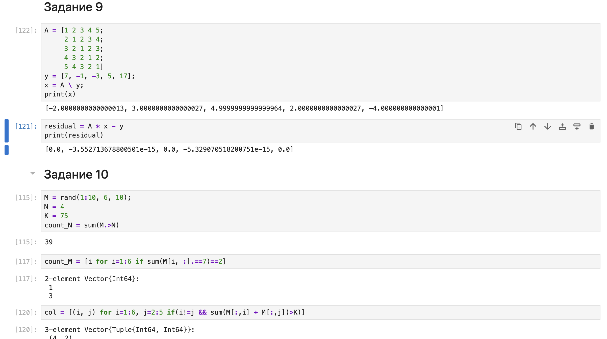{#fig:019 width=70%}

## Задание 11

Вычислим выражения (рис. [-@fig:020]). 

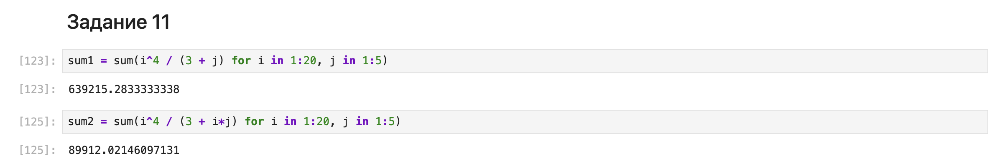{#fig:020 width=70%}

# Выводы

В результате выполнения данной лабораторной работы я освоила применение циклов функций и сторонних для Julia пакетов для решения задач линейной алгебры и работы с матрицами.
