---
## Front matter
title: "Лабораторная работа 5"
subtitle: "Построение графиков"
author: "Ланцова Яна Игоревна"

## Generic otions
lang: ru-RU
toc-title: "Содержание"

## Bibliography
bibliography: bib/cite.bib
csl: pandoc/csl/gost-r-7-0-5-2008-numeric.csl

## Pdf output format
toc: true # Table of contents
toc-depth: 2
lof: true # List of figures
lot: true # List of tables
fontsize: 12pt
linestretch: 1.5
papersize: a4
documentclass: scrreprt
## I18n polyglossia
polyglossia-lang:
  name: russian
  options:
    - spelling=modern
    - babelshorthands=true
polyglossia-otherlangs:
  name: english
## I18n babel
babel-lang: russian
babel-otherlangs: english
## Fonts
mainfont: IBM Plex Serif
romanfont: IBM Plex Serif
sansfont: IBM Plex Sans
monofont: IBM Plex Mono
mathfont: STIX Two Math
mainfontoptions: Ligatures=Common,Ligatures=TeX,Scale=0.94
romanfontoptions: Ligatures=Common,Ligatures=TeX,Scale=0.94
sansfontoptions: Ligatures=Common,Ligatures=TeX,Scale=MatchLowercase,Scale=0.94
monofontoptions: Scale=MatchLowercase,Scale=0.94,FakeStretch=0.9
mathfontoptions:
## Biblatex
biblatex: true
biblio-style: "gost-numeric"
biblatexoptions:
  - parentracker=true
  - backend=biber
  - hyperref=auto
  - language=auto
  - autolang=other*
  - citestyle=gost-numeric
## Pandoc-crossref LaTeX customization
figureTitle: "Рис."
tableTitle: "Таблица"
listingTitle: "Листинг"
lofTitle: "Список иллюстраций"
lotTitle: "Список таблиц"
lolTitle: "Листинги"
## Misc options
indent: true
header-includes:
  - \usepackage{indentfirst}
  - \usepackage{float} # keep figures where there are in the text
  - \floatplacement{figure}{H} # keep figures where there are in the text
---

# Цель работы

Основная цель работы -- освоить синтаксис языка Julia для построения графиков.

# Задание

1. Используя JupyterLab, повторите примерыи. При этом дополните графики
обозначениями осей координат, легендой с названиями траекторий, названиями
графиков и т.п.
2. Выполните задания для самостоятельной работы.

# Выполнение лабораторной работы

Выполним примеры из лабораторной работы для знакомства с пакетами по отрисовки графиков и их функциями (рис. [-@fig:001] - [-@fig:010]).

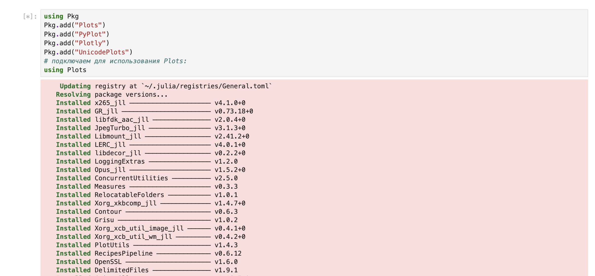{#fig:001 width=70%}

{#fig:002 width=70%}

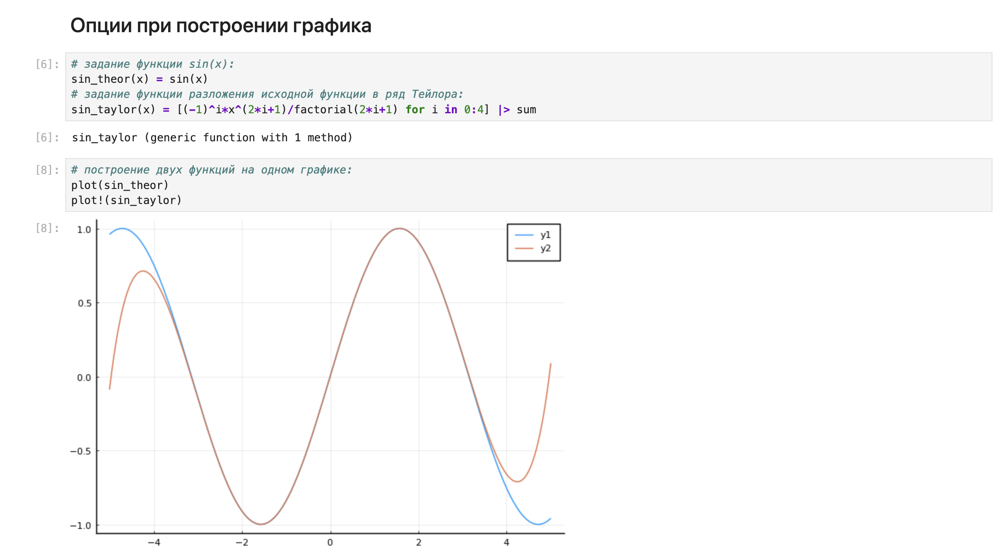{#fig:003 width=70%}

{#fig:004 width=70%}

{#fig:005 width=70%}

{#fig:006 width=70%}

{#fig:007 width=70%}

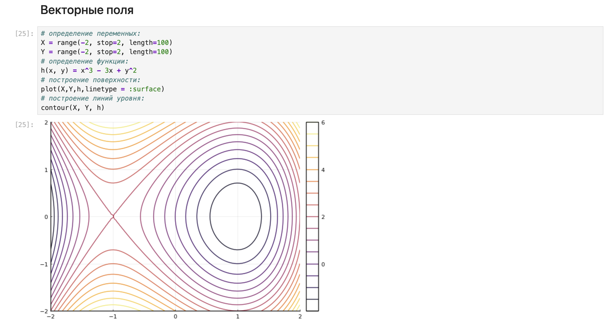{#fig:008 width=70%}

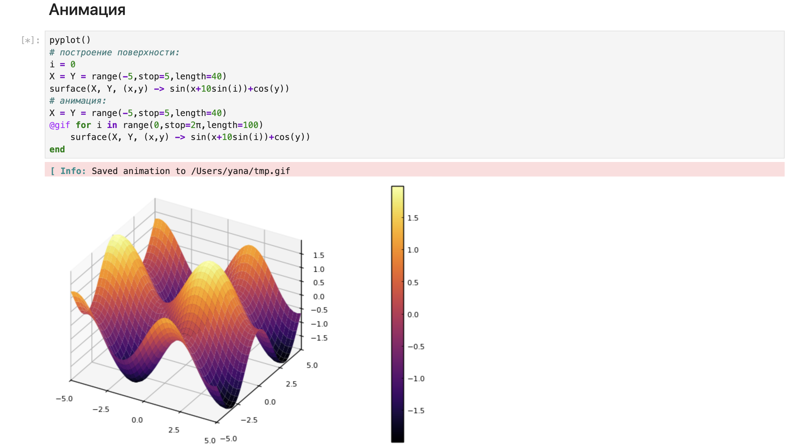{#fig:009 width=70%}

{#fig:010 width=70%}

Теперь перейдем к заданимям для самостоятельного выполнения

## Задание 1

Постройте все возможные типы графиков (простые, точечные, гистограммы и т.д.) функции $$ y = sin(x) $$ x = 0, 2*pi. Отобразим все графики в одном графическом окне. (рис. [-@fig:011] - [-@fig:012]).

{#fig:011 width=70%}

{#fig:012 width=70%}

## Задание 2

Постройте графики функции $$ y = sin(x) $$ x = 0, 2*pi со всеми возможными (сколько сможете вспомнить) типами оформления линий графика. Отобразите все графики в одном графическом окне (рис. [-@fig:013] - [-@fig:014]).

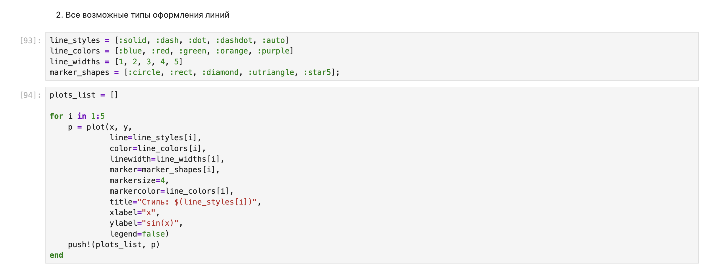{#fig:013 width=70%}

{#fig:014 width=70%}

## Задание 3

Постройте график функции $$ y(x) = pi*x^2*ln(x) $$ назовите оси соответственно. Пусть цвет рамки будет зелёным, а цвет самого графика — красным. Задайте расстояние между надписями и осями так, чтобы надписи полностью умещались в графическом окне. Задайте шрифт надписей. Задайте частоту отметок на осях координат (рис. [-@fig:016]).

{#fig:015 width=70%}

## Задание 4

Задайте вектор x = (−2, −1, 0, 1, 2). В одном графическом окне (в 4-х подокнах). Изобразите графически по точкам x значения функции $$ y(x) = x^3 − 3*x $$ в виде: точек, линий, линий и точек, кривой. Сохраним полученные изображения в файле figure_Lantsova.png (рис. [-@fig:016] - [-@fig:017]).

{#fig:016 width=70%}

{#fig:017 width=70%}

## Задание 5

Задайте вектор x = (3, 3.1, 3.2, … , 6). Постройте графики функций $$ y_1(x) = pi*x $$ и $$ y_2(x) = exp(x)* cos(x) $$ в указанном диапазоне значений аргумента x следующим образом (рис. [-@fig:018] - [-@fig:019]):

- постройте оба графика разного цвета на одном рисунке, добавьте легенду и сетку для каждого графика; укажите недостатки у данного построения;

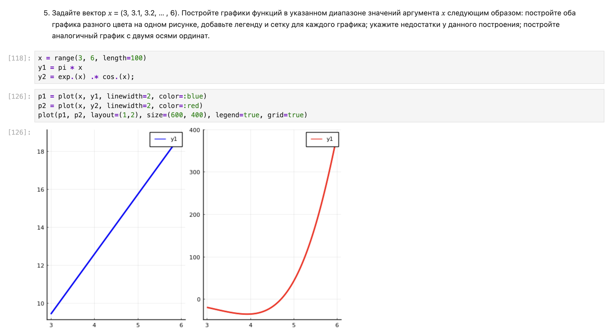{#fig:018 width=70%}

- постройте аналогичный график с двумя осями ординат

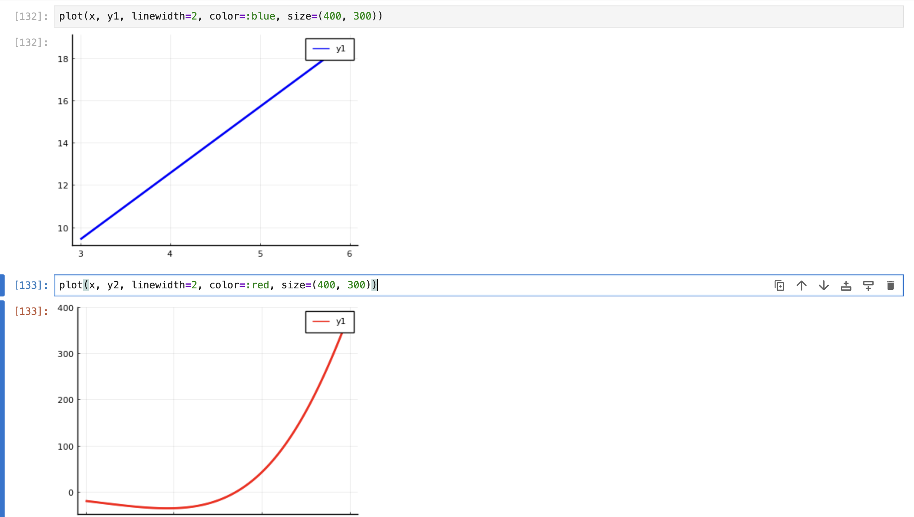{#fig:019 width=70%}

## Задание 6

Постройте график некоторых экспериментальных данных (придумайте сами), учитывая ошибку измерения (рис. [-@fig:020]).

{#fig:020 width=70%}

## Задание 7

Постройте точечный график случайных данных. Подпишите оси, легенду, название графика (рис. [-@fig:021]).

{#fig:021 width=70%}

## Задание 8

Постройте 3-мерный точечный график случайных данных. Подпишите оси, легенду, название графика (рис. [-@fig:022]).

{#fig:022 width=70%}

## Задание 9

Создайте анимацию с построением синусоиды. То есть вы строите последовательность графиков синусоиды, постепенно увеличивая значение аргумента. После соедините их в анимацию (рис. [-@fig:023]).

{#fig:023 width=70%}

## Задание 10

Постройте анимированную гипоциклоиду для 2 целых значений модуля k и 2 рациональных значений модуля k (рис. [-@fig:024] - [-@fig:028]).

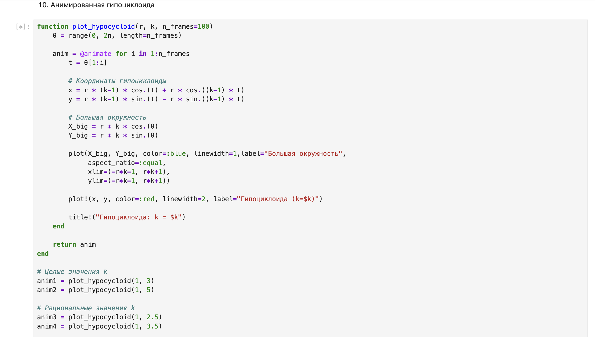{#fig:024 width=70%}

{#fig:025 width=70%}

{#fig:026 width=70%}

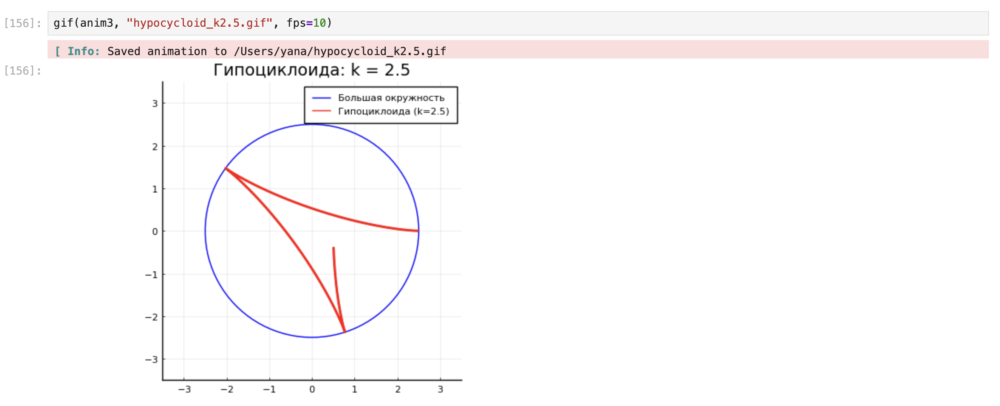{#fig:027 width=70%}

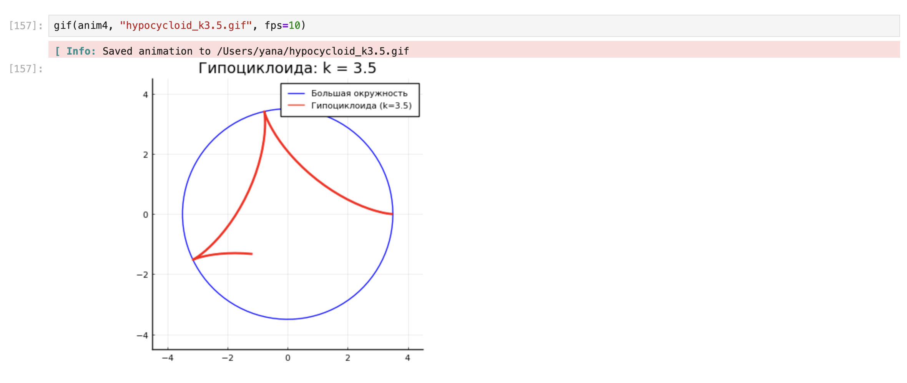{#fig:028 width=70%}

## Задание 11

Постройте анимированную эпициклоиду для 2 целых значений модуля k и 2 рациональных значений модуля k (рис. [-@fig:029] - [-@fig:033]).

{#fig:024 width=70%}

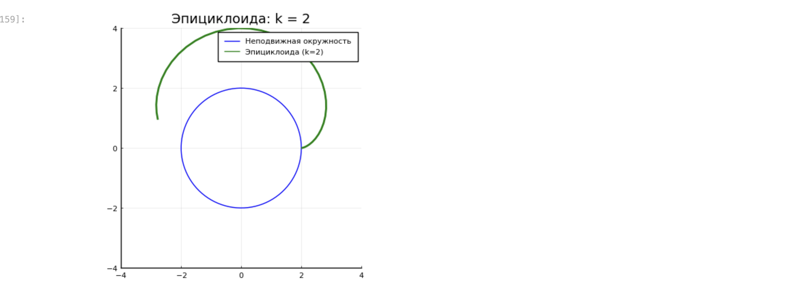{#fig:030 width=70%}

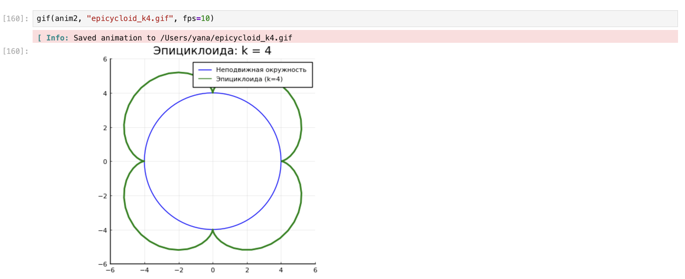{#fig:031 width=70%}

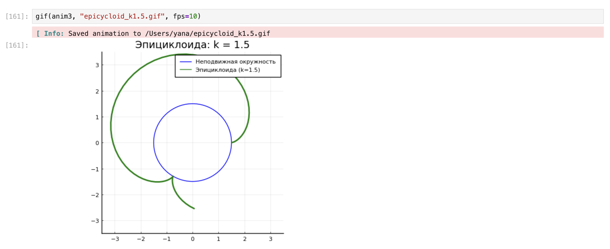{#fig:032 width=70%}

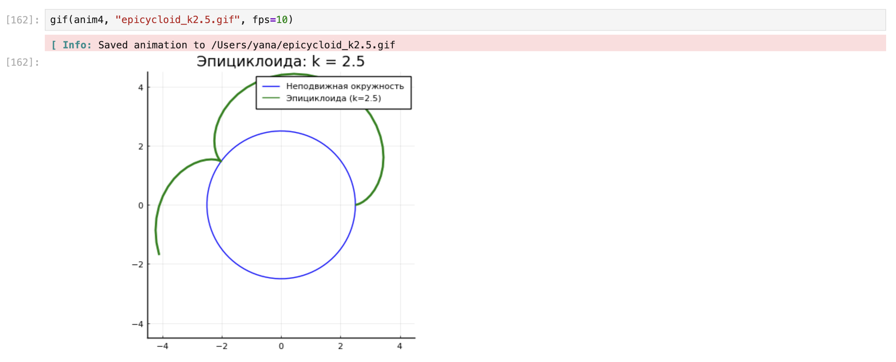{#fig:033 width=70%}

# Выводы

В результате выполнения данной лабораторной работы я освоила синтаксис языка Julia для построения графиков.
