---
## Front matter
title: "Лабораторная работа 6"
subtitle: "Решение моделей в непрерывном и дискретном времени"
author: "Ланцова Яна Игоревна"

## Generic otions
lang: ru-RU
toc-title: "Содержание"

## Bibliography
bibliography: bib/cite.bib
csl: pandoc/csl/gost-r-7-0-5-2008-numeric.csl

## Pdf output format
toc: true # Table of contents
toc-depth: 2
lof: true # List of figures
lot: true # List of tables
fontsize: 12pt
linestretch: 1.5
papersize: a4
documentclass: scrreprt
## I18n polyglossia
polyglossia-lang:
  name: russian
  options:
    - spelling=modern
    - babelshorthands=true
polyglossia-otherlangs:
  name: english
## I18n babel
babel-lang: russian
babel-otherlangs: english
## Fonts
mainfont: IBM Plex Serif
romanfont: IBM Plex Serif
sansfont: IBM Plex Sans
monofont: IBM Plex Mono
mathfont: STIX Two Math
mainfontoptions: Ligatures=Common,Ligatures=TeX,Scale=0.94
romanfontoptions: Ligatures=Common,Ligatures=TeX,Scale=0.94
sansfontoptions: Ligatures=Common,Ligatures=TeX,Scale=MatchLowercase,Scale=0.94
monofontoptions: Scale=MatchLowercase,Scale=0.94,FakeStretch=0.9
mathfontoptions:
## Biblatex
biblatex: true
biblio-style: "gost-numeric"
biblatexoptions:
  - parentracker=true
  - backend=biber
  - hyperref=auto
  - language=auto
  - autolang=other*
  - citestyle=gost-numeric
## Pandoc-crossref LaTeX customization
figureTitle: "Рис."
tableTitle: "Таблица"
listingTitle: "Листинг"
lofTitle: "Список иллюстраций"
lotTitle: "Список таблиц"
lolTitle: "Листинги"
## Misc options
indent: true
header-includes:
  - \usepackage{indentfirst}
  - \usepackage{float} # keep figures where there are in the text
  - \floatplacement{figure}{H} # keep figures where there are in the text
---

# Цель работы

Основной целью работы является освоение специализированных пакетов для решения задач в непрерывном и дискретном времени.

# Задание

1. Используя JupyterLab, повторить примерыи. При этом дополнить графики обозначениями осей координат, легендой с названиями траекторий, названиями графиков и т.п.
2. Выполнить задания для самостоятельной работы.

# Выполнение лабораторной работы

Выполним примеры из лабораторной работы для знакомства с работой с различными моделями и способами их задания  решения (рис. [-@fig:001] - [-@fig:010]).

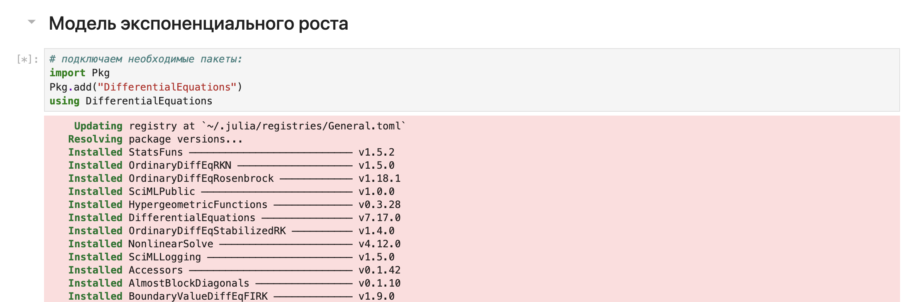{#fig:001 width=70%}

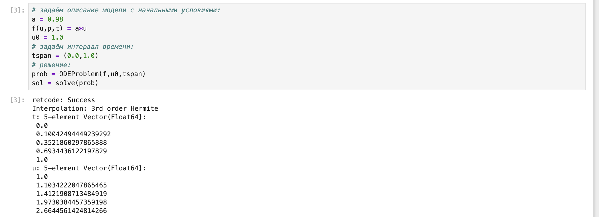{#fig:002 width=70%}

{#fig:003 width=70%}

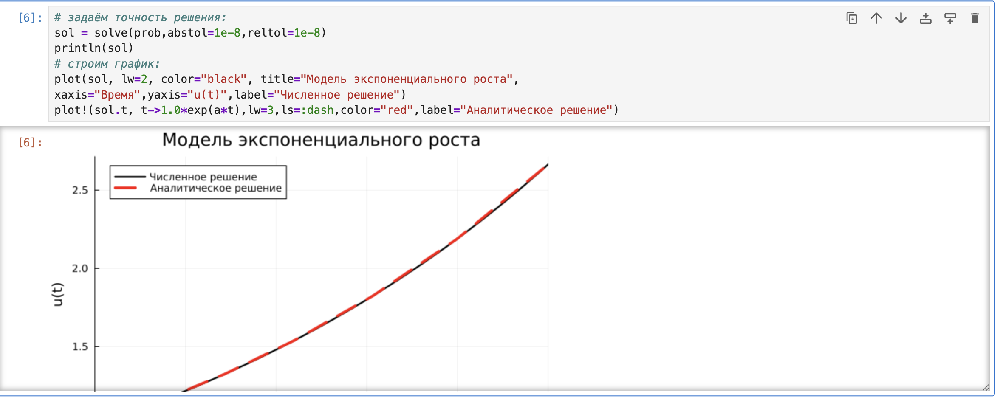{#fig:004 width=70%}

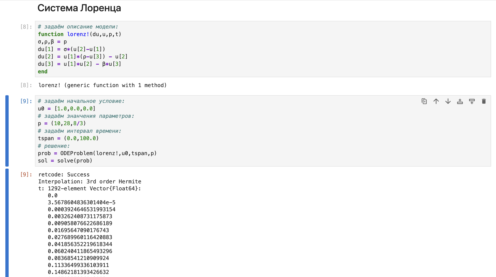{#fig:005 width=70%}

{#fig:006 width=70%}

{#fig:007 width=70%}

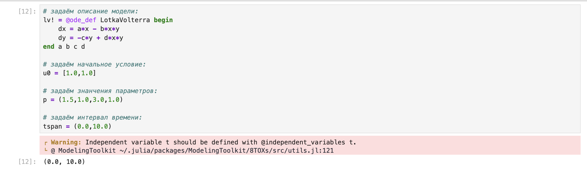{#fig:008 width=70%}

{#fig:009 width=70%}

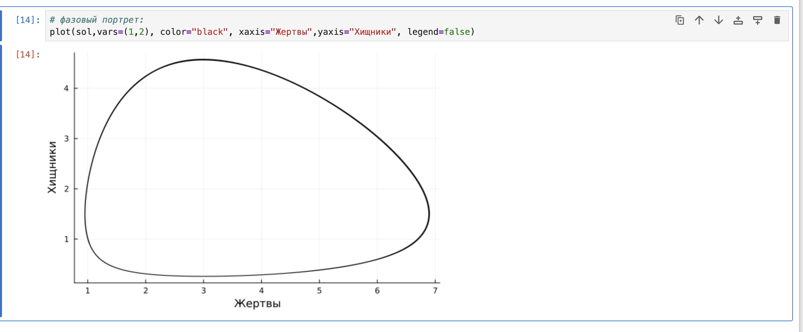{#fig:010 width=70%}

Теперь перейдем к заданимям для самостоятельного выполнения

## Задание 1

Реализуем и проанализируем модель роста численности изолированной популяции (модель Мальтуса):

$\dot{x} = ax, \quad a = b - c$

где:

- $x(t)$ — численность изолированной популяции в момент времени $t$
- $a$ — коэффициент роста популяции
- $b$ — коэффициент рождаемости
- $c$ — коэффициент смертности

Начальные данные и параметры зададим самостоятельно (рис. [-@fig:011] - [-@fig:015]). При коэффициенте роста 0.1 рост умеренный, малая начальная популяция была выбрана для наглядости экспоненциального роста.

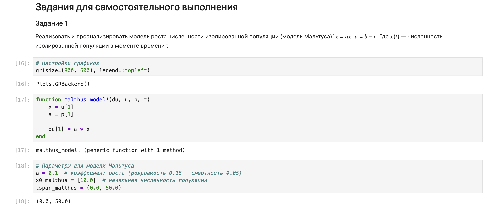{#fig:011 width=70%}

{#fig:012 width=70%}

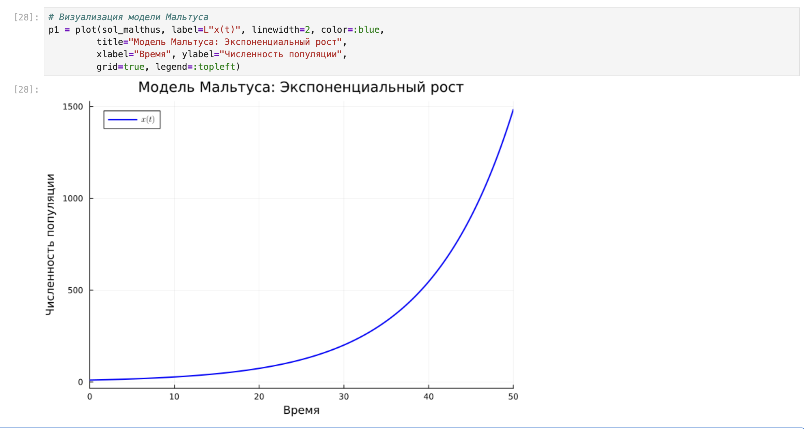{#fig:013 width=70%}

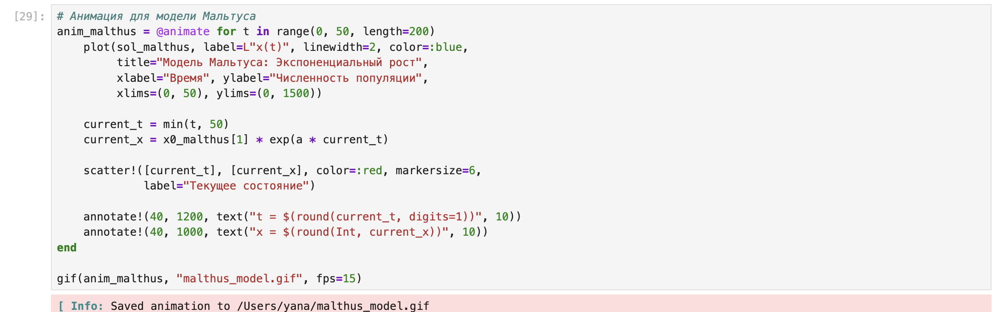{#fig:014 width=70%}

{#fig:015 width=70%}

## Задание 2

Реализуем и проанализируем логистическую модель роста популяции, заданную уравнением:

$\dot{x} = rx \left( 1 - \frac{x}{k} \right), \quad r > 0, \quad k > 0$

где:

- $r$ — коэффициент роста популяции
- $k$ — потенциальная ёмкость экологической системы (предельное значение численности популяции)

Начальные данные и параметры зададим самостоятельно (рис. [-@fig:016] - [-@fig:018]). В данной модели r = 0.2 - реалистичный коэффициент роста, в то время как K = 1000 - ограниченная ёмкость среды, 

{#fig:016 width=70%}

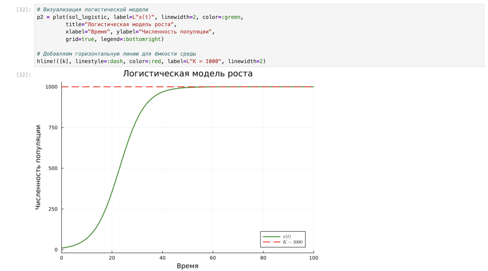{#fig:017 width=70%}

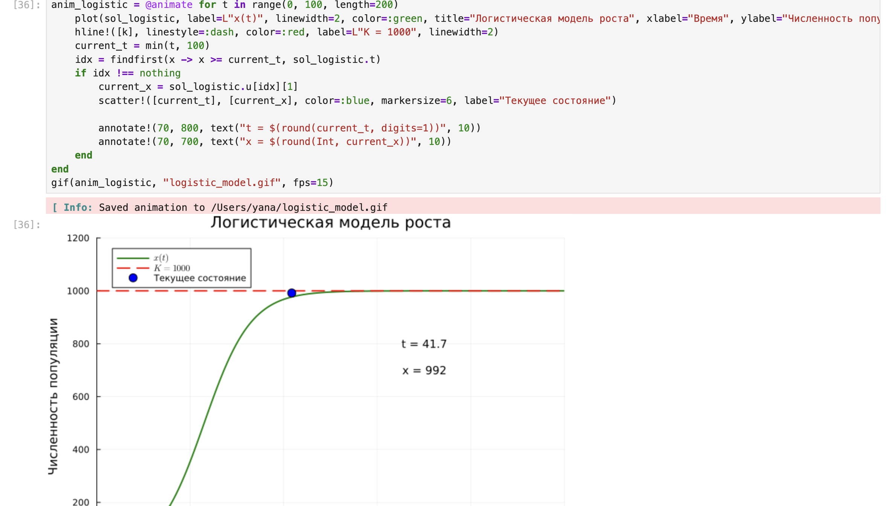{#fig:018 width=70%}

## Задание 3

Реализуем и проанализировать модель эпидемии Кермака–Маккендрика (рис. [-@fig:019] - [-@fig:022]):

$\begin{cases}
\dot{s} = -\beta i s, \\
\dot{i} = \beta i s - \nu i, \\
\dot{r} = \nu i,
\end{cases}$

где:

- $s(t)$ — численность восприимчивых к болезни индивидов в момент времени $t$
- $i(t)$ — численность инфицированных индивидов в момент времени $t$
- $r(t)$ — численность переболевших индивидов в момент времени $t$
- $\beta$ — коэффициент интенсивности контактов индивидов с последующим инфицированием
- $\nu$ — коэффициент интенсивности выздоровления инфицированных индивидов

{#fig:019 width=70%}

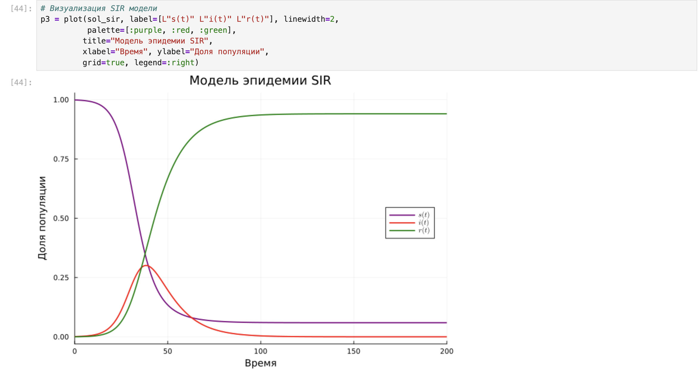{#fig:020 width=70%}

{#fig:021 width=70%}

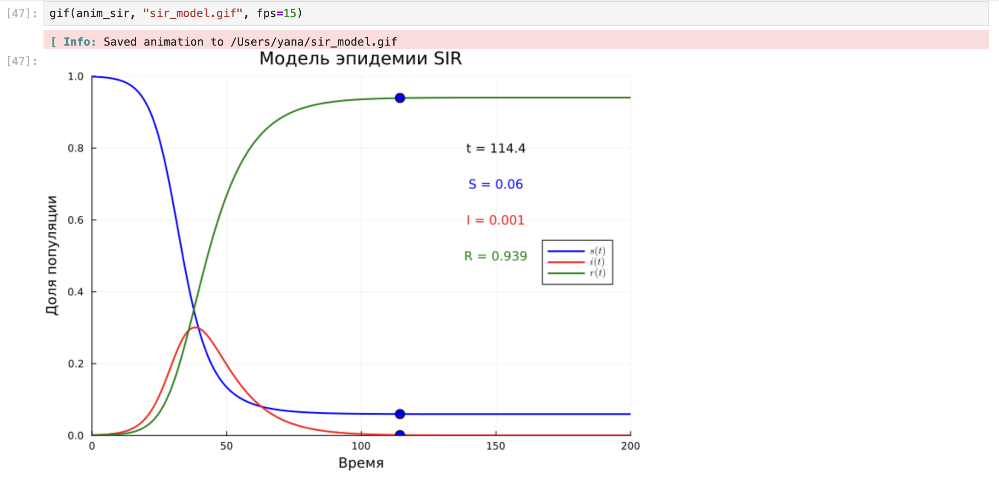{#fig:022 width=70%}

## Задание 4

Как расширение модели SIR (Susceptible-Infected-Removed) по результатам эпидемии испанки была предложена модель SEIR (Susceptible-Exposed-Infected-Removed):

$\begin{cases}
\dot{s}(t) = -\frac{\beta}{N}s(t)i(t), \\
\dot{e}(t) = \frac{\beta}{N}s(t)i(t) - \delta e(t), \\
\dot{i}(t) = \delta e(t) - \gamma i(t), \\
\dot{r}(t) = \gamma i(t).
\end{cases}$

где:

- $s(t)$ — численность восприимчивых особей
- $e(t)$ — численность экспонированных (латентно инфицированных) особей
- $i(t)$ — численность инфицированных и заразных особей
- $r(t)$ — численность выздоровевших или умерших особей
- $\beta$ — коэффициент заражения
- $\delta$ — коэффициент перехода из экспонированного в инфицированное состояние
- $\gamma$ — коэффициент выздоровления
- $N$ — общая численность популяции

Размер популяции сохраняется:

$s(t) + e(t) + i(t) + r(t) = N$

Исследуем модель SEIR и сравним с классической SIR-моделью (рис. [-@fig:023] - [-@fig:024]):

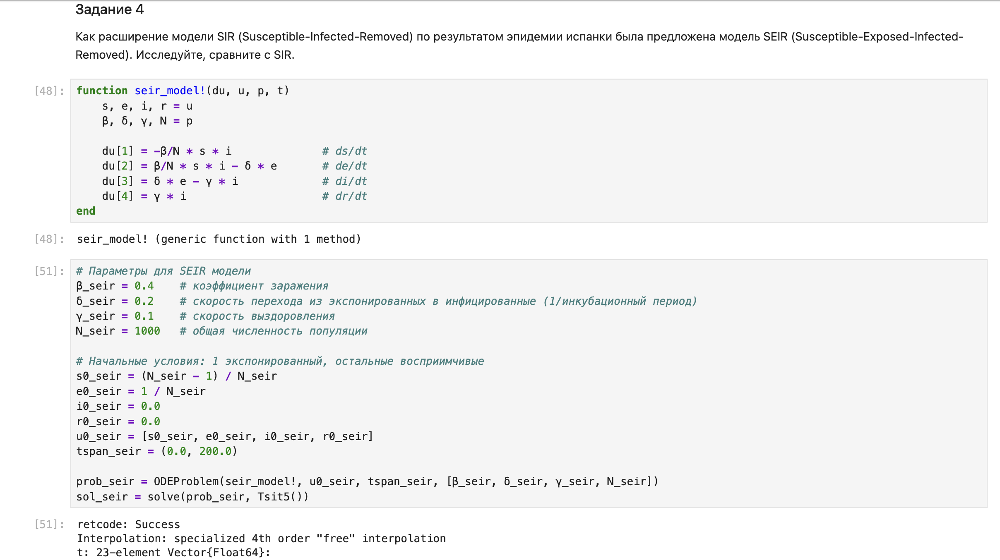{#fig:023 width=70%}

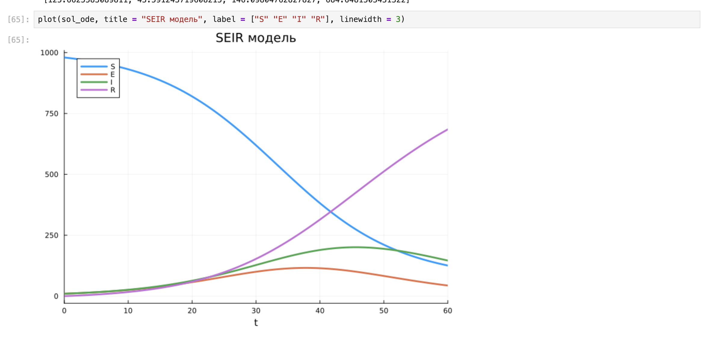{#fig:024 width=70%}

## Задание 5

Для дискретной модели Лотки–Вольтерры:

$\begin{cases} 
X_1(t+1) = aX_1(t)(1 - X_1(t)) - X_1(t)X_2(t), \\ 
X_2(t+1) = -cX_2(t) + dX_1(t)X_2(t). 
\end{cases}$

с начальными данными $a = 2, c = 1, d = 5$:

Найдите точку равновесия, получите и сравните аналитическое и численное решения, изобразите последнее на фазовом портрете (рис. [-@fig:025] - [-@fig:026]):

{#fig:025 width=70%}

{#fig:026 width=70%}

## Задание 6

Реализовать на языке Julia модель отбора на основе конкурентных отношений:

$\begin{cases} 
\dot{x} = \alpha x - \beta xy, \\ 
\dot{y} = \alpha y - \beta xy. 
\end{cases}$

где:

- $x, y$ — численности конкурирующих популяций
- $\alpha$ — коэффициент естественного прироста
- $\beta$ — коэффициент конкуренции

Начальные данные и параметры зададим самостоятельно (рис. [-@fig:027] - [-@fig:029]). Параметр альфа задан таким образом, чтобы рост обоих видов был умеренным. Интенсивность конкуренции усредненная.

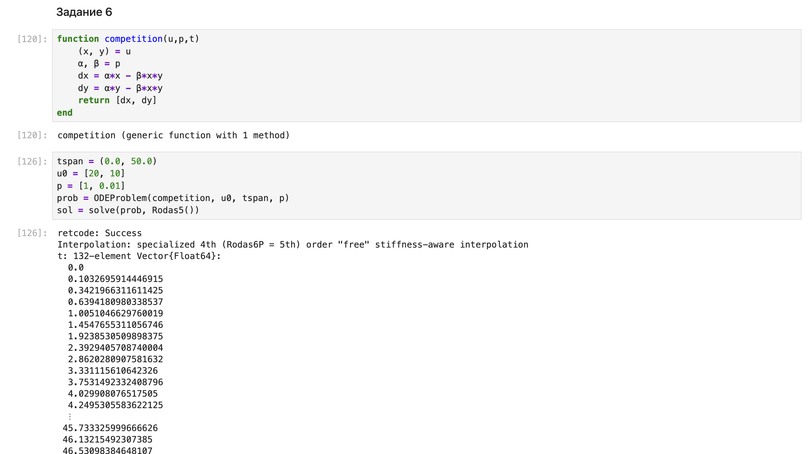{#fig:027 width=70%}

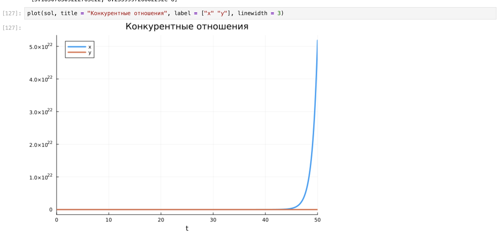{#fig:028 width=70%}

{#fig:029 width=70%}

## Задание 7

Реализовать на языке Julia модель консервативного гармонического осциллятора:

$\ddot{x} + \omega_0^2 x = 0, \quad x(t_0) = x_0, \quad \dot{x}(t_0) = y_0,$

где:

- $\omega_0$ — циклическая частота
- $x_0$ — начальное положение
- $y_0$ — начальная скорость

Начальные данные и параметры зададим самостоятельно (рис. [-@fig:030] - [-@fig:034]).

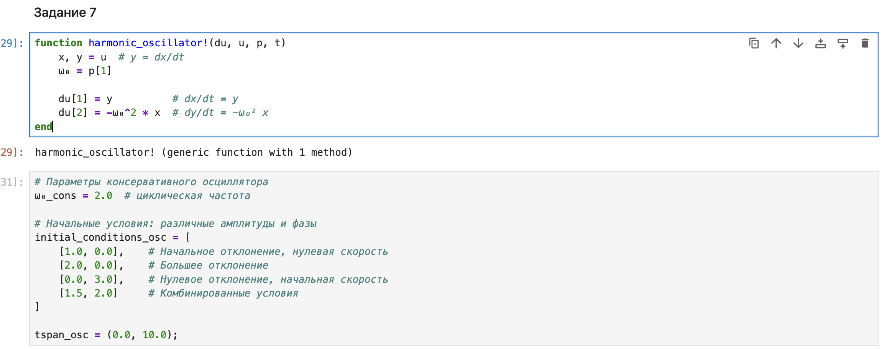{#fig:030 width=70%}

{#fig:031 width=70%}

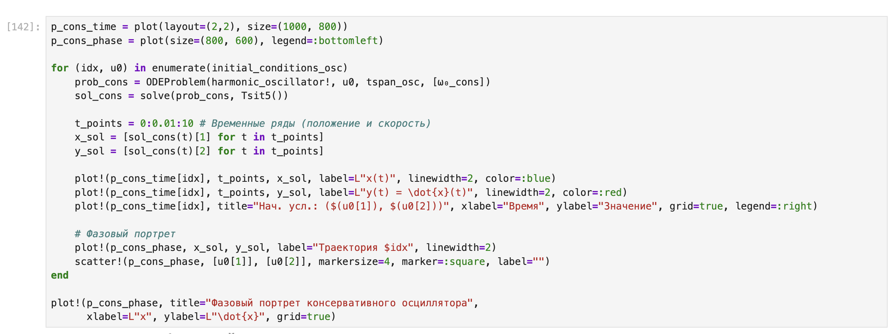{#fig:032 width=70%}

{#fig:033 width=70%}

{#fig:034 width=70%}

## Задание 8

Реализовать на языке Julia модель свободных колебаний гармонического осциллятора:

$\ddot{x} + 2\gamma \dot{x} + \omega_0^2 x = 0, \quad x(t_0) = x_0, \quad \dot{x}(t_0) = y_0,$

где:

- $\omega_0$ — циклическая частота
- $\gamma$ — параметр, характеризующий потери энергии
- $x_0$ — начальное положение
- $y_0$ — начальная скорость

Начальные данные и параметры зададим самостоятельно (рис. [-@fig:035] - [-@fig:038]). Как параметры для графика были выбраны слабое затухание, среднее, критичсекое и сильное.

{#fig:035 width=70%}

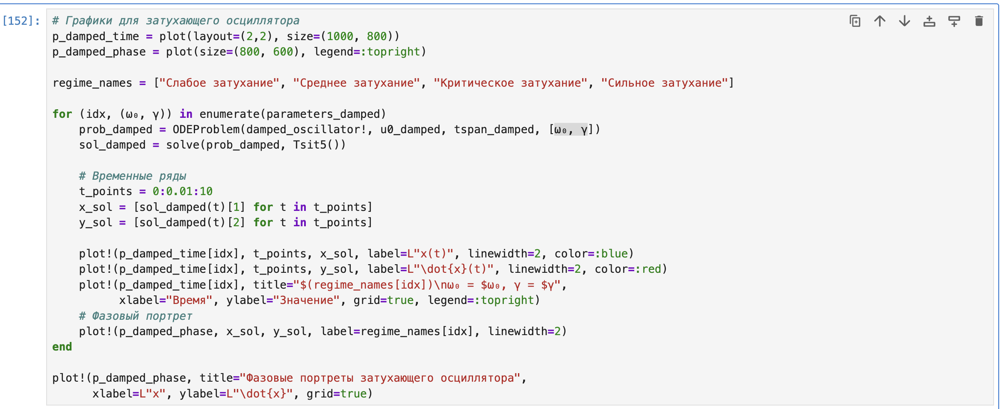{#fig:036 width=70%}

{#fig:037 width=70%}

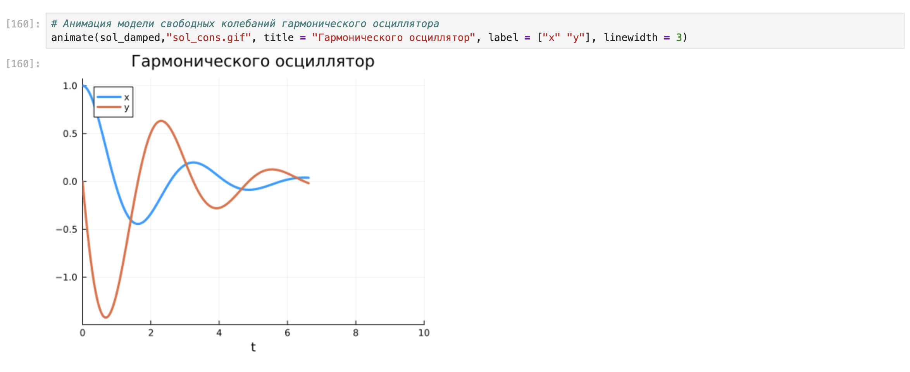{#fig:038 width=70%}

# Выводы

В результате выполнения данной лабораторной работы я освоила специализированные пакеты для решения задач в непрерывном и дискретном времени.
